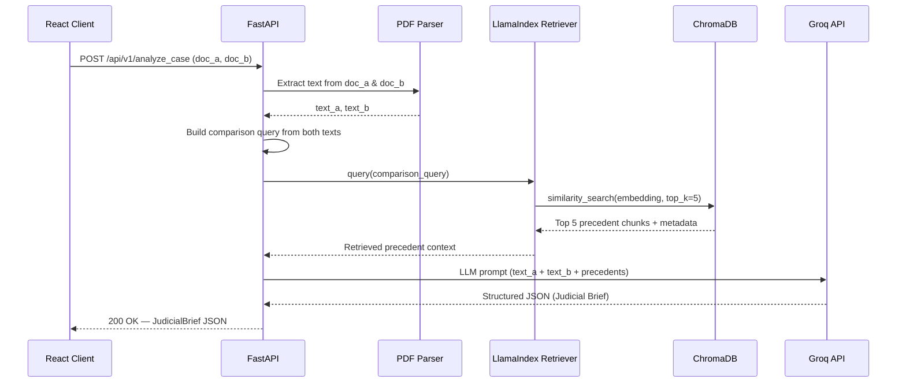

# Single-View Case Analyzer — Implementation Roadmap

## 1. Directory Structure

```
LegalFAQagent/
├── .env                          # API keys (GROQ_API_KEY)
├── .env.example                  # Template for required env vars
├── .gitignore                    # Ignore .env, venv/, chroma_db/, node_modules/
│
├── downloaded_pdfs/              # [EXISTING] 30 Orissa HC judgment PDFs
│   ├── Civil_Appeal_112__NCE__1992.pdf
│   ├── CRLMC_3390_2023.pdf
│   └── ...
│
├── backend/
│   ├── requirements.txt          # Python dependencies
│   ├── ingest.py                 # Phase 2: Offline ingestion pipeline
│   ├── config.py                 # Centralized settings (paths, model names)
│   ├── main.py                   # Phase 3: FastAPI application entry point
│   ├── models.py                 # Pydantic request/response schemas
│   ├── services/
│   │   ├── __init__.py
│   │   ├── pdf_parser.py         # PyMuPDF text extraction
│   │   ├── retriever.py          # LlamaIndex retrieval logic
│   │   └── analyzer.py           # Groq LLM prompt construction & call
│   └── prompts/
│       └── judicial_brief.py     # System & user prompt templates
│
├── chroma_db/                    # [AUTO-GENERATED] ChromaDB persistent store
│
├── frontend/
│   ├── package.json
│   ├── public/
│   │   └── index.html
│   └── src/
│       ├── App.jsx               # Main layout (split-screen)
│       ├── App.css               # Global styles
│       ├── index.js              # React entry point
│       ├── components/
│       │   ├── UploadPanel.jsx    # Left panel: file upload + submit
│       │   ├── BriefDisplay.jsx   # Right panel: JSON brief renderer
│       │   ├── LoadingSpinner.jsx # Analysis-in-progress indicator
│       │   └── ErrorBanner.jsx    # Error state display
│       └── services/
│           └── api.js            # Axios calls to FastAPI backend
│
├── DownloderScript.py            # [EXISTING] Selenium PDF scraper
├── tableinfo.py                  # [EXISTING] Table structure inspector
├── plan.md                       # System design document
└── implementation.md             # This file
```

---

## 2. Phase 1: Environment & Setup

### 2.1 Python Environment

```bash
# From project root
python3 -m venv venv
source venv/bin/activate
```

### 2.2 Dependencies (`backend/requirements.txt`)

```txt
# --- Core Framework ---
fastapi==0.115.6
uvicorn[standard]==0.34.0
python-multipart==0.0.20      # For file uploads

# --- PDF Processing ---
PyMuPDF==1.25.3                # fitz — fast, CPU-friendly PDF text extraction

# --- LlamaIndex (v0.10+ modular) ---
llama-index-core==0.10.30
llama-index-readers-file==0.1.6
llama-index-vector-stores-chroma==0.1.6
llama-index-embeddings-huggingface==0.2.0
llama-index-llms-groq==0.1.3

# --- Vector Store ---
chromadb==0.4.24

# --- Embeddings Runtime ---
sentence-transformers==3.0.1   # Pulled by HuggingFace embedding
torch==2.2.2+cpu               # CPU-only PyTorch (NO CUDA)

# --- Utilities ---
python-dotenv==1.0.1
pydantic==2.10.5
```

> [!IMPORTANT]
> **CPU-Only PyTorch**: Install with the CPU index to avoid downloading 2GB+ of CUDA libraries:
> ```bash
> pip install torch==2.2.2+cpu --index-url https://download.pytorch.org/whl/cpu
> pip install -r backend/requirements.txt
> ```

### 2.3 API Key Management (`.env`)

```env
# .env (root of project — NEVER commit this file)
GROQ_API_KEY=gsk_xxxxxxxxxxxxxxxxxxxxxxxxxxxxxxxxxxxxxxxx
```

```env
# .env.example (commit this as a template)
GROQ_API_KEY=your_groq_api_key_here
```

### 2.4 `.gitignore` additions

```gitignore
.env
venv/
chroma_db/
__pycache__/
node_modules/
frontend/build/
*.pyc
```

---

## 3. Phase 2: Offline Ingestion Pipeline (`backend/ingest.py`)

This script is run **once** (or whenever new PDFs are added). It is NOT part of the runtime server.

### 3.1 Step-by-Step Logic

```
┌────────────────────────────────────────────────────────────┐
│  For each PDF in downloaded_pdfs/:                         │
│                                                            │
│  1. PARSE FILENAME ──► Extract case_type, number, year     │
│     Regex: r'^([A-Za-z_]+?)_(\d[\d_]*?)_+(\d{4})\.pdf$'   │
│                                                            │
│  2. EXTRACT TEXT ──► PyMuPDF (fitz)                        │
│     fitz.open(path) → iterate pages → page.get_text()      │
│                                                            │
│  3. CREATE DOCUMENT ──► LlamaIndex Document object         │
│     Document(text=full_text, metadata={                    │
│         "case_type": "Civil_Appeal",                       │
│         "case_number": "112",                              │
│         "year": "1992",                                    │
│         "source_filename": "Civil_Appeal_112__NCE__1992"   │
│     })                                                     │
│                                                            │
│  4. CHUNK ──► SentenceSplitter(chunk_size=512, overlap=50) │
│                                                            │
│  5. EMBED ──► BAAI/bge-small-en-v1.5 (device="cpu")       │
│                                                            │
│  6. STORE ──► ChromaDB collection "orissa_hc_judgments"    │
└────────────────────────────────────────────────────────────┘
```

### 3.2 Filename Parsing Strategy

Given observed filenames like:
```
Civil_Appeal_112__NCE__1992.pdf
CRLMC_3390_2023.pdf
WP_C__18559_2015.pdf
Writ_Petition__Criminal__68_2008.pdf
```

The parser should:
1.  Strip the `.pdf` extension.
2.  Extract the **year** as the last 4-digit number.
3.  Extract the **case number** as the primary numeric segment(s) before the year.
4.  Everything preceding the case number is the **case type**.
5.  Store the full original filename as `source_filename` for traceability.

### 3.3 Key Configuration

```python
# backend/config.py
import os
from dotenv import load_dotenv

load_dotenv()

# Paths
PDF_DIR = os.path.join(os.path.dirname(__file__), "..", "downloaded_pdfs")
CHROMA_PERSIST_DIR = os.path.join(os.path.dirname(__file__), "..", "chroma_db")
CHROMA_COLLECTION = "orissa_hc_judgments"

# Models
EMBED_MODEL_NAME = "BAAI/bge-small-en-v1.5"
EMBED_DEVICE = "cpu"
LLM_MODEL = "llama-3-8b-8192"

# API Keys
GROQ_API_KEY = os.getenv("GROQ_API_KEY")
```

### 3.4 Running the Ingestion

```bash
cd backend
python ingest.py
# Expected output:
# [1/30] Ingesting: Civil_Appeal_112__NCE__1992.pdf → case_type=Civil_Appeal, year=1992
# [2/30] Ingesting: CRLMC_3390_2023.pdf → case_type=CRLMC, year=2023
# ...
# ✅ Ingestion complete. 30 documents → ~450 chunks stored in ChromaDB.
```

---

## 4. Phase 3: The FastAPI Backend

### 4.1 API Contract

#### `POST /api/v1/analyze_case`

**Request:** `multipart/form-data`

| Field    | Type           | Description                         |
|----------|----------------|-------------------------------------|
| `doc_a`  | `UploadFile`   | PDF file for Party A (e.g., Prosecution / Petitioner) |
| `doc_b`  | `UploadFile`   | PDF file for Party B (e.g., Defense / Respondent)      |

**Response:** `application/json` — `200 OK`

```json
{
  "status": "success",
  "judicial_brief": {
    "case_overview": {
      "doc_a_title": "Prosecution Brief — State vs. XYZ",
      "doc_b_title": "Defense Brief — XYZ vs. State",
      "date_analyzed": "2026-02-26T12:00:00Z"
    },
    "party_a_summary": {
      "key_claims": ["...", "..."],
      "cited_statutes": ["Section 302 IPC", "..."],
      "core_argument": "..."
    },
    "party_b_summary": {
      "key_claims": ["...", "..."],
      "cited_statutes": ["Section 300 Exception 1 IPC", "..."],
      "core_argument": "..."
    },
    "comparative_analysis": {
      "points_of_agreement": ["Both parties agree that..."],
      "points_of_contention": [
        {
          "issue": "Whether the act was premeditated",
          "party_a_position": "...",
          "party_b_position": "..."
        }
      ]
    },
    "relevant_precedents": [
      {
        "case_name": "Civil Appeal 112 (NCE) 1992",
        "source_filename": "Civil_Appeal_112__NCE__1992.pdf",
        "year": "1992",
        "relevance_summary": "This precedent addresses...",
        "excerpt": "...relevant text from judgment..."
      }
    ],
    "analytical_observations": [
      "The defense's reliance on Exception 1 of Section 300 may be weakened by...",
      "Three of the five retrieved precedents favor the prosecution's interpretation..."
    ]
  }
}
```

**Error Response:** `422 / 500`

```json
{
  "status": "error",
  "message": "Failed to extract text from doc_a. Ensure it is a valid PDF."
}
```

#### `GET /api/v1/health`

Simple health-check endpoint returning `{"status": "ok", "vector_store_ready": true}`.

---

### 4.2 Backend Flow (per request)



### 4.3 Service Layer Details

#### `services/pdf_parser.py`
- Function: `extract_text_from_upload(upload_file: UploadFile) -> str`
- Reads the `SpooledTemporaryFile` into bytes, opens with `fitz.open(stream=bytes, filetype="pdf")`.
- Returns concatenated page text.

#### `services/retriever.py`
- Initializes the ChromaDB vector store on startup (singleton).
- Function: `retrieve_precedents(query: str, top_k: int = 5) -> List[PrecedentResult]`
- Uses `VectorStoreIndex.from_vector_store()` + `as_retriever()`.

#### `services/analyzer.py`
- Function: `generate_judicial_brief(text_a: str, text_b: str, precedents: List) -> JudicialBrief`
- Constructs the structured prompt from `prompts/judicial_brief.py`.
- Calls Groq via `llama_index.llms.groq.Groq`.
- Parses the response JSON into the `JudicialBrief` Pydantic model.

### 4.4 Running the Backend

```bash
cd backend
uvicorn main:app --reload --host 0.0.0.0 --port 8000
# API docs available at: http://localhost:8000/docs
```

---

## 5. Phase 4: Frontend Integration (React)

### 5.1 Setup

```bash
npx -y create-react-app frontend
cd frontend
npm install axios
```

### 5.2 Layout — Split-Screen Design

```
┌──────────────────────────────────────────────────────────┐
│                    ⚖️ Case Analyzer                       │
├────────────────────────┬─────────────────────────────────┤
│                        │                                 │
│   📄 UPLOAD PANEL      │   📋 JUDICIAL BRIEF             │
│                        │                                 │
│  ┌──────────────────┐  │   Case Overview                │
│  │ Document A (PDF) │  │   ─────────────                │
│  │ [Choose File]    │  │   Party A Summary              │
│  └──────────────────┘  │   Party B Summary              │
│                        │   ─────────────                │
│  ┌──────────────────┐  │   Comparative Analysis         │
│  │ Document B (PDF) │  │     • Points of Agreement     │
│  │ [Choose File]    │  │     • Points of Contention    │
│  └──────────────────┘  │   ─────────────                │
│                        │   Relevant Precedents          │
│  [ 🔍 Analyze Case ]  │     • Case 1 (1992)           │
│                        │     • Case 2 (2023)           │
│                        │   ─────────────                │
│  Status: Ready         │   Analytical Observations      │
│                        │                                 │
├────────────────────────┴─────────────────────────────────┤
│  ⚠️ Disclaimer: Not legal advice.                        │
└──────────────────────────────────────────────────────────┘
```

### 5.3 Component Responsibilities

| Component           | Responsibility                                                     |
|---------------------|--------------------------------------------------------------------|
| `App.jsx`           | Top-level split-screen layout, state management, API orchestration |
| `UploadPanel.jsx`   | Two file inputs (PDF only), validation, submit button, status text |
| `BriefDisplay.jsx`  | Renders the `judicial_brief` JSON into expandable, styled sections |
| `LoadingSpinner.jsx`| Animated spinner during analysis (LLM calls take 5-15s)           |
| `ErrorBanner.jsx`   | Displays error messages from failed API calls                      |

### 5.4 API Service (`services/api.js`)

```javascript
import axios from 'axios';

const API_BASE = process.env.REACT_APP_API_URL || 'http://localhost:8000';

export const analyzeCase = async (docA, docB) => {
  const formData = new FormData();
  formData.append('doc_a', docA);
  formData.append('doc_b', docB);

  const response = await axios.post(
    `${API_BASE}/api/v1/analyze_case`,
    formData,
    {
      headers: { 'Content-Type': 'multipart/form-data' },
      timeout: 120000, // 2min timeout for LLM processing
    }
  );
  return response.data;
};

export const healthCheck = async () => {
  const response = await axios.get(`${API_BASE}/api/v1/health`);
  return response.data;
};
```

### 5.5 CORS Configuration (Backend)

Add to `backend/main.py`:
```python
from fastapi.middleware.cors import CORSMiddleware

app.add_middleware(
    CORSMiddleware,
    allow_origins=["http://localhost:3000"],  # React dev server
    allow_methods=["*"],
    allow_headers=["*"],
)
```

### 5.6 Running the Frontend

```bash
cd frontend
npm start
# Opens at http://localhost:3000
# Backend must be running at http://localhost:8000
```

---

## 6. Development Sequence & Milestones

| #  | Milestone                  | Verification                                       | Est. Time |
|----|----------------------------|-----------------------------------------------------|-----------|
| 1  | Environment set up         | `python -c "import fitz, chromadb, llama_index"`     | 30 min    |
| 2  | Ingestion pipeline works   | `chroma_db/` populated, query returns results        | 2 hrs     |
| 3  | FastAPI `/health` returns  | `curl localhost:8000/api/v1/health`                  | 30 min    |
| 4  | `/analyze_case` returns JSON | Test with 2 sample PDFs via Swagger UI             | 3 hrs     |
| 5  | React upload + display     | End-to-end upload → brief rendered in browser        | 2 hrs     |
| 6  | Polish & edge cases        | Error handling, loading states, disclaimer           | 1 hr      |

**Total Estimated Development Time: ~9 hours**

---

## 7. Critical Constraints Checklist

- [ ] PyTorch installed with **CPU-only** wheels (`+cpu` suffix)
- [ ] `HuggingFaceEmbedding(device="cpu")` explicitly set
- [ ] No model larger than `bge-small-en-v1.5` (~130MB) loaded locally
- [ ] All LLM inference routed through **Groq API** (zero local GPU usage)
- [ ] ChromaDB uses **persistent storage** (`chroma_db/` directory)
- [ ] `.env` file is in `.gitignore`
- [ ] CORS allows `localhost:3000` → `localhost:8000`
