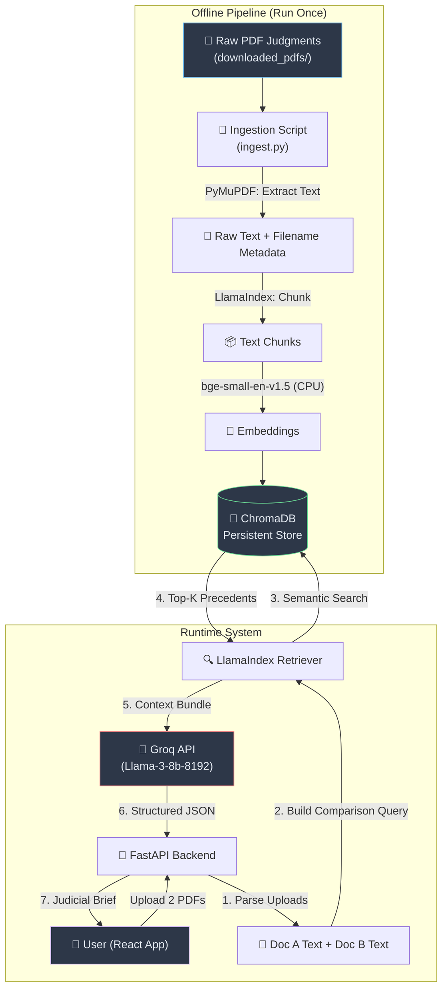

# Single-View Case Analyzer — System Design & Architecture

## 1. Executive Summary

The **Single-View Case Analyzer** is an AI-powered legal research tool designed for the Indian judicial context. A user uploads two opposing case documents — for example, Prosecution and Defense briefs — and the system produces a unified **Judicial Brief**: a structured, side-by-side comparison of claims, identification of points of contention, and a grounding of every argument against real precedents retrieved from a local vector database of Orissa High Court judgments. It transforms hours of manual cross-referencing into a single, citation-backed analysis view — delivered in seconds, not days.

---

## 2. Problem & Solution

### The Problem

Indian legal proceedings generate voluminous, jargon-heavy documents. Comparing two opposing case files — identifying where they agree, where they diverge, and which historical precedents support either side — currently requires a trained paralegal spending hours manually cross-referencing. This creates an **accessibility gap**: smaller firms, independent advocates, and legal-aid organizations simply cannot afford this labor.

### The Solution

This system applies **Retrieval-Augmented Generation (RAG)** to bridge that gap. It:
1.  **Reads** both uploaded documents.
2.  **Compares** them structurally — extracting claims, counter-claims, cited statutes, and arguments.
3.  **Retrieves** the most relevant precedents from a pre-built local knowledge base of Orissa High Court judgments.
4.  **Generates** a structured "Judicial Brief" JSON that presents the analysis in a clear, neutral format.

> [!IMPORTANT]
> **Disclaimer**: This tool is an **analytical aid**. It does NOT provide legal advice, predict outcomes, or replace the judgment of a qualified legal professional.

---

## 3. Architecture Diagram



### Data Flow Summary

| Step | Action                             | Component             |
|------|------------------------------------|-----------------------|
| 0    | Ingest PDFs to vector store        | `ingest.py` (offline) |
| 1    | User uploads Doc A & Doc B         | React → FastAPI       |
| 2    | Extract text from both uploads     | PyMuPDF               |
| 3    | Semantic search for precedents     | LlamaIndex → ChromaDB |
| 4    | Bundle context for LLM prompt      | FastAPI               |
| 5    | Generate structured Judicial Brief | Groq API              |
| 6    | Return JSON to frontend            | FastAPI → React       |

---

## 4. Core Components

### 4.1 Layer 1: Ingestion (Zero-CSV Strategy)

The ingestion pipeline requires **no external CSV or metadata file**. All metadata is derived directly from the PDF filenames already present in `downloaded_pdfs/`.

**Filename Convention** (observed from existing data):
```
Civil_Appeal_112__NCE__1992.pdf   →  Case Type: Civil Appeal
                                     Case No:   112 (NCE)
                                     Year:      1992

CRLMC_3390_2023.pdf               →  Case Type: CRLMC
                                     Case No:   3390
                                     Year:      2023
```

**Process:**
1.  Walk the `downloaded_pdfs/` directory.
2.  For each PDF, parse the filename with a regex to extract `case_type`, `case_number`, and `year`.
3.  Use **PyMuPDF** (`fitz`) to extract the full text — it's fast, CPU-friendly, and handles scanned PDFs poorly (acceptable for these digital-native court PDFs).
4.  Pass text + metadata to LlamaIndex's `SentenceSplitter` for chunking (chunk size: 512 tokens, overlap: 50).
5.  Embed chunks using `BAAI/bge-small-en-v1.5` on CPU.
6.  Persist to ChromaDB.

---

### 4.2 Layer 2: Storage (ChromaDB)

| Property        | Value                                      |
|-----------------|--------------------------------------------|
| Engine          | ChromaDB (local, persistent)               |
| Collection Name | `orissa_hc_judgments`                       |
| Persist Dir     | `./chroma_db/`                             |
| Metadata Fields | `case_type`, `case_number`, `year`, `source_filename` |

ChromaDB is chosen because it:
- Requires **zero infrastructure** (no Docker, no server process).
- Supports **persistent local storage** on disk.
- Integrates natively with LlamaIndex's `ChromaVectorStore`.

---

### 4.3 Layer 3: Retrieval (LlamaIndex)

The retrieval layer uses LlamaIndex (v0.10+ modular architecture) to:
1.  Accept a synthesized query derived from both uploaded case documents.
2.  Perform **vector similarity search** against the ChromaDB collection.
3.  Return the **Top-5** most relevant precedent chunks along with metadata.

**Configuration:**
- Embed model: `HuggingFaceEmbedding(model_name="BAAI/bge-small-en-v1.5", device="cpu")`
- Retriever: `VectorIndexRetriever(similarity_top_k=5)`

---

### 4.4 Layer 4: Generation (Groq LLM)

All heavy LLM inference is offloaded to the **Groq API** to respect the 16GB RAM / no-GPU constraint.

| Property     | Value                       |
|--------------|-----------------------------|
| Provider     | Groq Cloud API              |
| Model        | `llama-3-8b-8192`           |
| Context      | 8192 tokens                 |
| Temperature  | 0.1 (deterministic, factual)|
| Role         | Structured comparison & synthesis |

**Prompt Strategy:** The system prompt instructs the LLM to act as a neutral judicial analyst. It receives:
- Extracted text from Document A (Prosecution / Petitioner)
- Extracted text from Document B (Defense / Respondent)
- Top-K retrieved precedent excerpts with metadata

It outputs a **structured JSON** (`JudicialBrief`) with sections for:
- Summary of each party's position
- Identified points of agreement and contention
- Relevant precedents with citations
- Neutral analytical observations

---

## 5. Out of Scope (Anti-Goals)

The following are **explicitly NOT part** of this system's design:

| Anti-Goal                     | Reason                                                                 |
|-------------------------------|------------------------------------------------------------------------|
| 🔒 User Authentication       | This is a single-user analytical tool, not a multi-user SaaS platform. |
| 🗄️ Multi-Tenant Database     | One local ChromaDB instance is sufficient for the POC scope.            |
| 🕷️ Web Scraping Module        | `DownloderScript.py` already exists and has been run; PDF data is static and pre-existing. Scraping is a separate, offline concern. |
| ⚖️ Legal Advice Generation   | The system analyzes and compares; it does not advise or predict.         |
| 🌐 Deployment / CI-CD        | The system is designed for local execution on the developer's machine.  |
| 📱 Mobile Responsiveness     | Desktop-first React SPA is sufficient for the legal research use case. |
